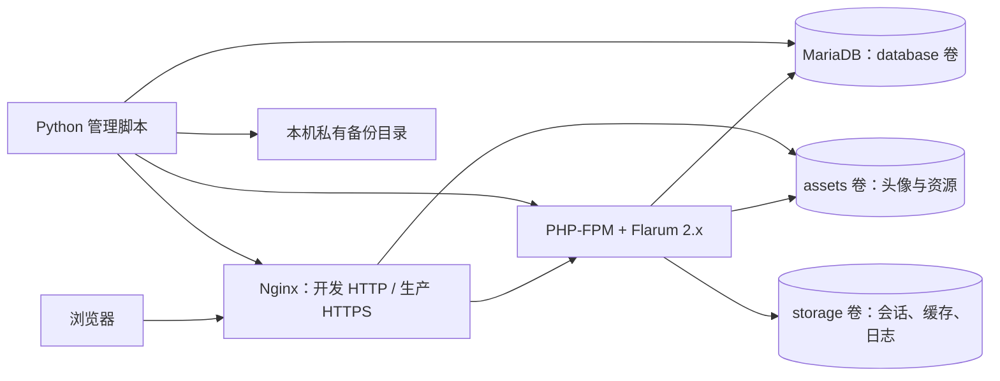

# 基础架构

## 组件和数据流

Compose 只发布 Web 端口，数据库和 PHP-FPM 不发布宿主端口。开发绑定回环地址。生产配置独立使用 TLS、应用只读镜像和持久卷，不挂载完整源代码。

Windows 替代方案使用 PHP 内置开发服务器，直接读 `public/`，数据库绑定 `127.0.0.1:3307`；数据在 `.runtime/db/`，上传在 `public/assets/`，应用状态在 `storage/`。该方案只用于个人开发，不承接公网请求。

## 保留上游 Composer 结构

- `composer.json` + `composer.lock`：直接依赖约束和精确的传递依赖版本。`vendor/` 由 Composer 生成。
- `site.php` / `flarum` / `public/index.php`：保留官方站点与命令行入口，不修改核心。
- `extend.php`：保留上游扩展入口，Phase 0 未添加业务扩展。
- `config/environment.php`：项目环境变量桥接，返回 Flarum 2.x 的真实配置键。
- `config.php`：首次官方 CLI 安装成功后改为调用桥接文件，不保存数据库密码、不提交 Git。
- `docker/`、两份 Compose：团队开发环境和独立生产部署骨架。
- `scripts/`：Python 管理、静态检查和审计；`tests/`：错误路径行为检查及真实集成检查。

## 数据与配置边界

`APP_URL`、数据库连接和调试状态来自项目桥接；论坛名称在首次安装时作为 `forum_title` 写入数据库。修改名称应在后台操作，不会在每次启动时覆盖现有设置。邮件与大部分 Flarum 设置在数据库中，由后台管理。`.env` 的邮件字段与 `LOG_LEVEL` 为交接占位项，并非 Flarum 原生配置键。

备份通过停止应用写入后导出数据库并归档 assets、storage、扩展入口与锁定版本，随后恢复服务。数据库本身保持运行；没有默认删除或重建数据库的启动动作。新增附件扩展前必须确认其存储位置，并扩展备份清单。

依赖基线与 RC 的生产边界见 [ADR 001](decisions/001-runtime.md)。生产服务器、域名、论坛正式名称、SMTP 和外部备份存储尚待决定，不预设真实值。
